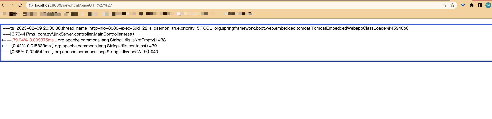
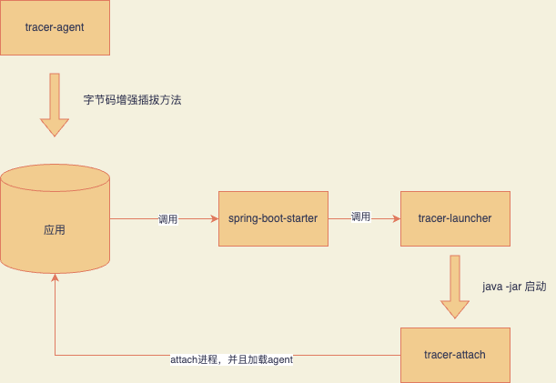

# tracer
基于arthas的trace的方法耗时检测工具

Tracer能主动搜索配置的方法调用路径，渲染和统计整个调用链路上的所有性能开销和追踪调用链路，并且实时回显在页面还能自定义处理结果

## 

## 1、使用方法

### 1.1 springboot使用：

只支持 spring boot 2

1、pom引入：

```xml
<dependency>
  <groupId>io.github.liudaolunboluo.tracer</groupId>
  <artifactId>tracer-spring-boot-starter</artifactId>
  <version>1.1.0</version>
</dependency>
```

2、在项目的配置文件中配置：

```yaml
spring:
  tracer:
    enabled: true
```

开启tracer，请注意如果不配置此配置项默认为false也就是不启动tracer。

3、在项目的配置文件中配置tracer：

```yaml
tracer:
	#是否开启jdk自带方法的追踪，默认为false
  isSkipJdk: true
  #要追踪的类的集合
  target-class-list:
  	#类的全路径
    - full-class-name: com.xxx.yyy.AService
    #要追踪的方法集合
      target-method-list:
      	#方法名
        - methodName: test
        	#是否保存原始trace之后的json格式数据，默认为否
          isSaveOriginalResult: true
          # 耗时上限，即超过该配置值的耗时的结果才会打印
          cost-more-than: 10
          # 最大打印次数，默认为1000
          max-output: 3
        - methodName: test2
          isSaveOriginalResult: true
        - methodName: hgetall
    - full-class-name: com.xxx.yyy.BService
      target-method-list:
        - methodName: testA
        - methodName: testB
        - methodName: testC
```

4、启动你的项目，日志里有类似于如下打印：

```
 attach 20221 success!
 tracer launch success
```

则代表tracer启动成功。

5、打开页面：

```json
http://ip:port/{context-path}/view.html?baseUrl={context-path}
```

注：{context-path}是你spring配置里：

```yaml
server:
  servlet:
    context-path: {context-path}
```

配置的值，也就是你的服务公共前缀。

6、运行你配置的方法，即可以在页面上实时显示trace之后的结果（不用刷新界面）:



#### 1.1.1、自定义回调

如果你想自己处理trace之后的结果，那么可以自定义回调

新建一个类继承`TraceCallback`这个抽象类并且自定义实现`callback`方法，最后加上`@Component`注入到spring 中即可

注意，回调不宜过多，因为最后调用回调的都是被观测方法主线程同步串行调用，如果回调过多或者单个回调用时过长就会严重影响主方法的性能，所以建议不要自定义太多回调并且如果单个回调耗时太长建议再回调实现里换成异步实现。

### 1.2、非spring boot使用：

pom中引入:

```
<dependency>
  <groupId>io.github.liudaolunboluo.tracer</groupId>
  <artifactId>tracer-launcher</artifactId>
  <version>1.1.0</version>
</dependency>
```

然后再代码中启动tracer：

```java
TracerLauncher tracerLauncher = new TracerLauncher();
        TracerAttachParam param = new TracerAttachParam();
        param.setIsSkipJdk(true);
        param.setPid("pid");
param.setTargetClassList(List.of(TargetClass.builder().fullClassName("com.XXX.AService")
                .targetMethodList(List.of(TargetMethod.builder().methodName("process").build(), 	TargetMethod.builder().methodName("invoke").build()))
                .build()));
tracerLauncher.launch(param, List.of(new XXTraceCallback()));
```

注意：如果是以这种方式启动的话是没有默认的回调实现的， 也就是说结果不会自己打印在页面上，需要自己在启动的时候:`tracerLauncher.launch(param, List.of(new XXTraceCallback()));`传入自己的回调实现，


## 2、实现原理

本项目基于Java agent和Java字节码增强技术，**核心逻辑字节码增强插拔方法参考了Arthas的trace实现**。

各个模块作用：

- tracer-launcher：启动模块，负责启动attach进程并且传递参数
- tracer-attach: attach模块，因为java不允许自己attach自己，所以只能单独启动一个进程来attach目标进程,attach成功之后就注入我们的agent
- tracer-agent:  核心agent模块，负责类增强，插拔注入我们的逻辑
- tracer-common: 公共模块，一些抽离出来的方法和类
- tracer-spring-boot-starter: spring boot的starter模块，原理就是整合spring配置和获取自定义回调的实现然后调用launcher模块. 

大概的原理如下图：




构建：

```shell
chomod +x /scripts/build.sh
./scripts/build.sh
```


todo（已经规划了，后面版本迭代） ：

1、优化结果界面

2、非spring boot项目实现前端界面回显

4、实现项目启动之后的trace，即可以在启动之后的界面上手动选择要trace的类和方法来观测

5、trace结果的导出和另存为
